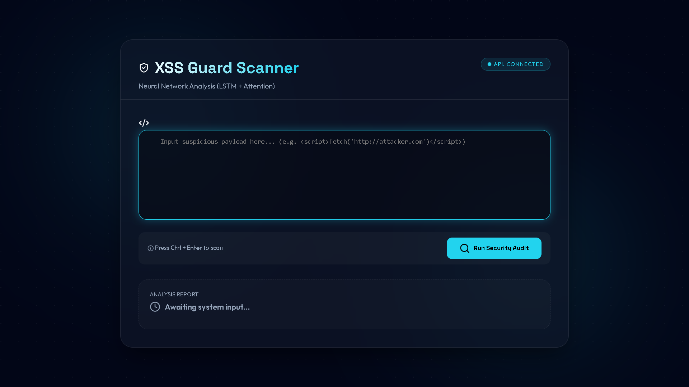
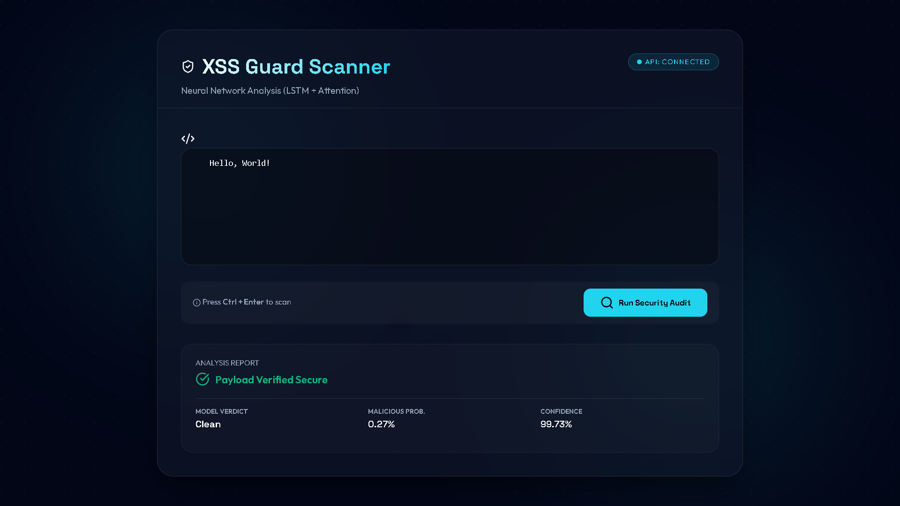
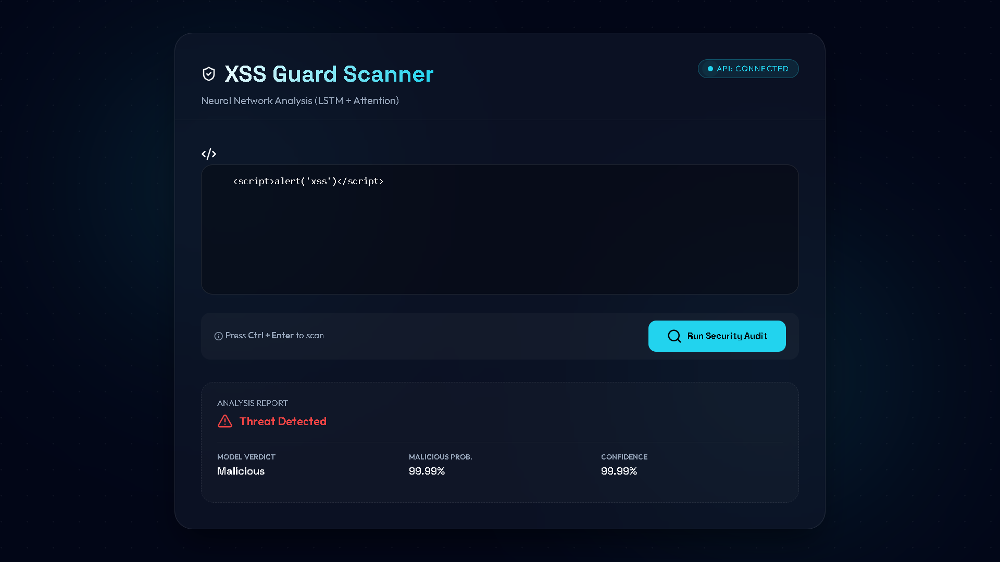
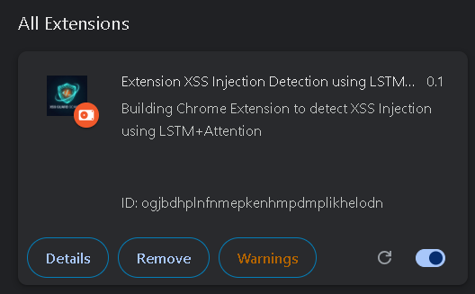
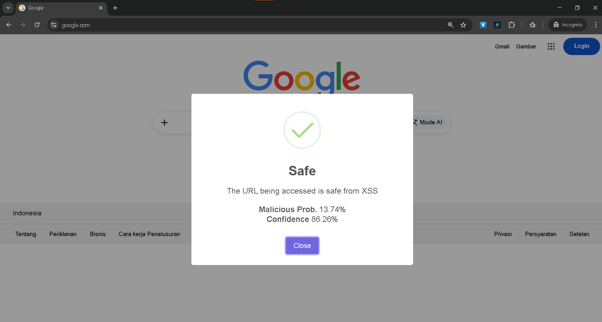
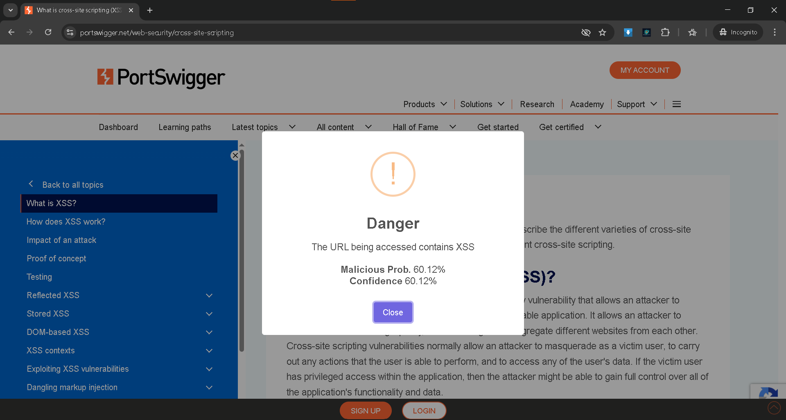

# LSTM-Attention-XSS-Detection

This repository contains a deep learning model utilizing Long Short-Term Memory (LSTM) networks with an Attention mechanism to detect and classify Cross-Site Scripting (XSS) payloads.

## Overview
This project aims to detect XSS attacks accurately using machine learning. In addition to the model, this repository also contains a **Chrome Browser Extension** that utilizes the model to detect malicious XSS scripts.

## Dataset
Dataset credit goes to: [https://github.com/obarrera/ML-XSS-Detection](https://github.com/obarrera/ML-XSS-Detection)

We used their dataset and applied preprocessing steps to clean and format the data, resulting in the `datasetClean.csv` file available in this repository.

## Features
- XSS detection using an LSTM + Attention model.
- Preprocessed, ready-to-use dataset (`datasetClean.csv`).
- A built-in Chrome Browser Extension for detecting XSS.

# How to Run the Backend

1. Install Python dependencies:
   pip install -r ../../requirements.txt
2. Train the model by running all cells in the Jupyter Notebook:
   LSTM_Attention_XSS.ipynb
3. Run the backend Flask server:
   python app.py

# How to Build the Extension

- Deploy your Model (or use the locally running backend URL / ngrok)
- Copy the link (e.g., ngrok link) to your clipboard
- Open detect.cjs file
- Paste the link into the detect.cjs file on line 8
- Install the dependencies:
  npm install
- Build the extension:
  npm install browserify
  npx browserify detect.cjs -o bundle.js
- Load the extension in your browser:
  - Go to your browser's extensions page
  - Enable Developer Mode
  - Load unpacked (select the Application/Browser Extension folder)
- Run your extension

## App Preview

  
  
  
  
  
  

